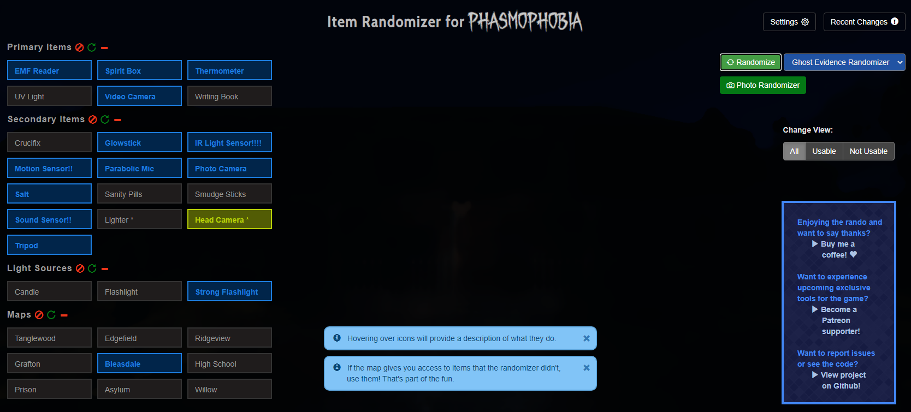
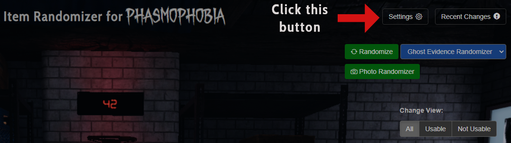
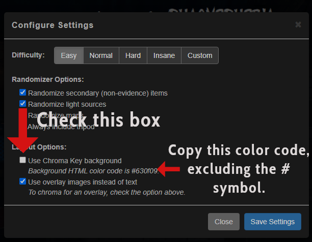
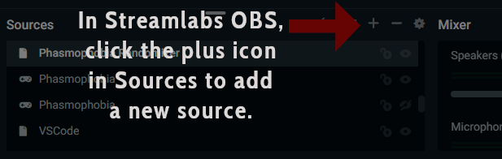
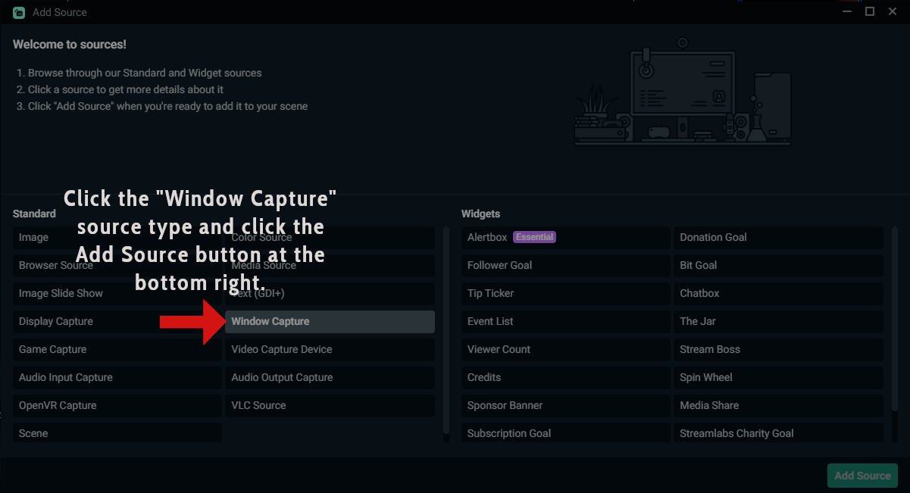
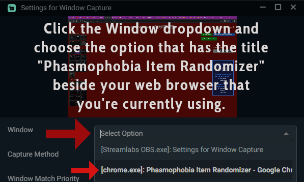
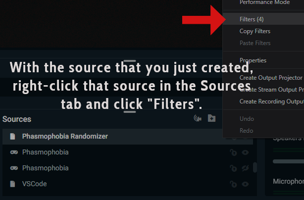
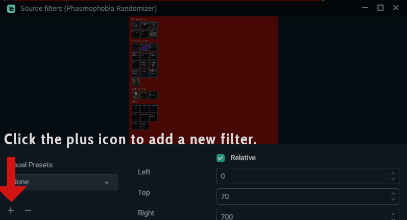
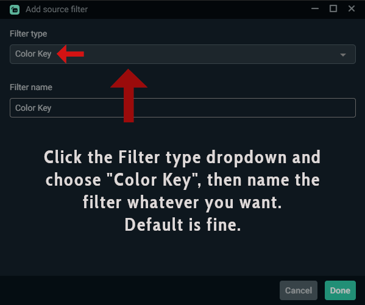
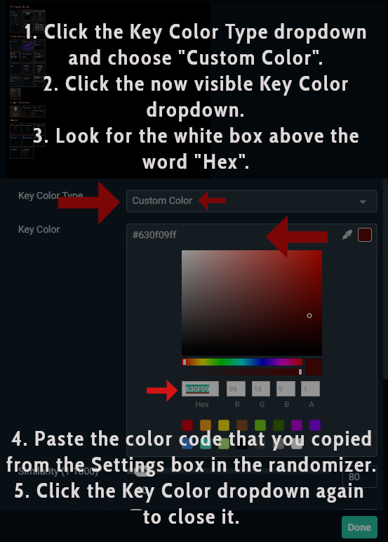

# Item Randomizer for Phasmophobia

With the Item Randomizer for Phasmophobia, you can randomize evidence items, non-evidence items, light sources, and even what maps to play! 4 different difficulty settings allow you to tailor the randomizing experience to your skill level, and you can optionally disable certain settings that you don't want to randomize.

If you use this, please feel free to reach out and let me know what you think! I'm on Twitter at: https://twitter.com/fuzzygameson 

## How to Use

To use, you can visit the Github hosted page of this at: 
https://fuzzygameson.github.io/phasmophobia_randomizer/index.html

That's it! Just click the "Randomize" button and enjoy. :D 

If you want to customize your experience, use the "Settings" button to set specific options.

## Licensing and Disclaimers

This project is covered by Github's "no license" default licensing. As such, it is not permissible for anyone to copy, distribute, or modify this project, whether for commercial benefit or otherwise. Neglecting to abide by these limitations can result in legal action.

This project is not affiliated with or endorsed by Kinetic Games -- the creator of the game Phasmophobia -- in any way.

This project does not reuse any assets, code, or other exclusive resources from the game Phasmophobia. This project is a supplementary free-to-use tool created with text and thumbnail references to the items, ghosts, and locations referenced in the game. For the purposes of classification, this project/tool is a randomizer tracking program for the game and, as such, does not modify anything about the game executable or the game's included files -- much like other randomizer tracking programs created for other games.

## Feedback / Questions?

### "I wish the tool did this."

Use the Issues tab at the top to leave suggestions like this! The tool is constantly being updated, so your ideas could be added. :)

### "I found a bug."

Use the Issues tab at the top to report the bug! That gives me an organized way to triage and address bugs in a quick fashion.

### "I love this! Thank you so much!"

Aw, that's awesome! I'm glad you enjoyed it. :D 

If you want to donate even a small amount to show gratitude, [you should buy me a coffee](https://www.buymeacoffee.com/fuzzygames)!

### "I want to create a tool based on this or host this project. Can I fork/reuse this project's code?

Unfortunately, that is not allowed under the default licensing for Github projects. Please see the Copyright Notice and Statement section above for more information.

### "I stream and I want to use this as an overlay."

Well, that's a built-in feature! Scroll down a bit and you'll get instructions on how to set that up in Streamlabs OBS. Instructions for OBS Studio should be similar. 

If you use a different streaming software and would like to see instructions for it, use the Issues tab at the top to request instructions for your streaming software of choice!

 
 
## Streaming Overlay Setup
 
 
1. On the randomizer page, click the "Settings" button at the top right of the screen.

2. Under "Layout Options", check the "Use Chroma Key background" checkbox. Underneath the option is the color code for the color key that you'll set up; copy the code (the code starts with # and has some letters/numbers) by highlighting it and doing either right-click and Copy or Ctrl + C.

3. In Streamlabs OBS, click the plus icon beside the "Sources" section at the bottom. This will add a new source.

4. Click the "Window Capture" source type under the "Standard" section of sources on the left, then click the Add Source button.

5. Click the dropdown labelled "Window" and choose the option that includes the title "Phasmophobia Item Randomizer" beside the name of the web browser that you're currently using for the randomizer, then click the Done button.

6. Now that the source is added to the "Sources" section at the bottom, right-click that newly added source and choose the "Filters" option.

7. Click the plus icon on the left (under "Visual Presets") to add a new filter.

8. Click the dropdown labelled "Filter type" and choose the "Color Key" option. For "Filter name", you can name it whatever you like. The default text is fine. Click the Done button after.

9. Click the dropdown labelled "Key Color Type" and choose "Custom Color" from the dropdown. This will make a new option named "Key Color" appear. Click the "Key Color" dropdown and clear out the text in the "Hex" textbox below the color picker. Paste the color code that you copied in step 2 into this Hex textbox. Click the "Key Color" dropdown again (the area that shows the color code, an eye dropper, and a color box at the top) to close the dropdown. Click the Done button.

Congrats, you should have a transparent randomizer interface now! If you'd like to only show the randomized items, etc., you can add a "Crop / Pad" filter using the same steps you used to add the "Color Key" filter in steps 6-8.