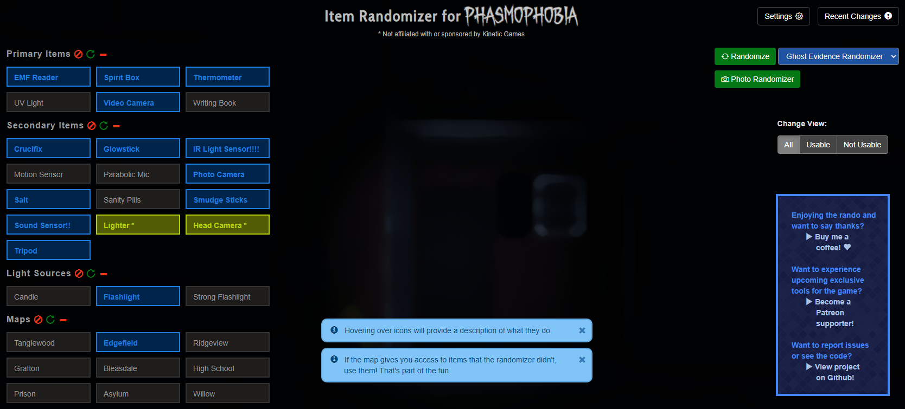

# Item Randomizer for Phasmophobia

With the Item Randomizer for Phasmophobia, you can randomize evidence items, non-evidence items, light sources, and even what maps to play! 4 different difficulty settings allow you to tailor the randomizing experience to your skill level, and you can optionally disable certain settings that you don't want to randomize.

If you use this, please feel free to reach out and let me know what you think! I'm on Twitter at: https://twitter.com/fuzzygameson 

## How to use

To use, you can visit the Github hosted page of this at: 
https://fuzzygameson.github.io/phasmophobia_randomizer/index.html

That's it! Just click the "Randomize" button and enjoy. :D 

If you want to customize your experience, use the "Settings" button to set specific options.

## Potential issues

### "My settings aren't being saved!"

If you run into any issues saving settings, you can always download the ZIP of the project by clicking the "Code" button at the top right of the file listing for this repository. Extract that downloaded zip somewhere on your computer, then open the "index.html" file in your browser.

This is a potential issue that I plan to test and account for at some point. The original version of this randomizer was a local download, so the storage might not work as intended for a GitHub hosted solution. Thanks for being patient on the fix.